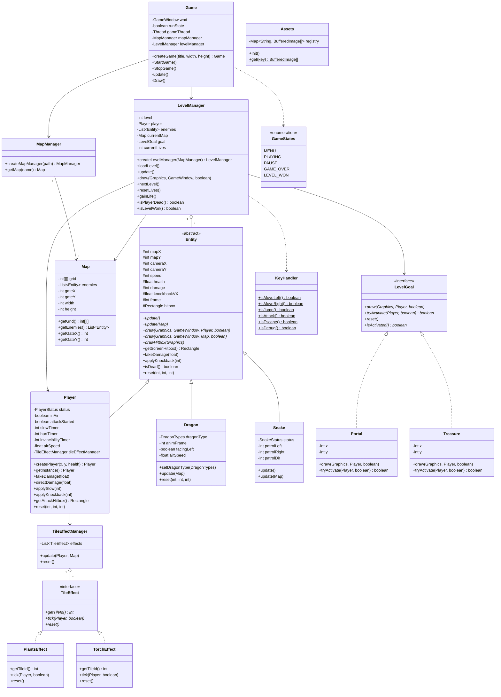
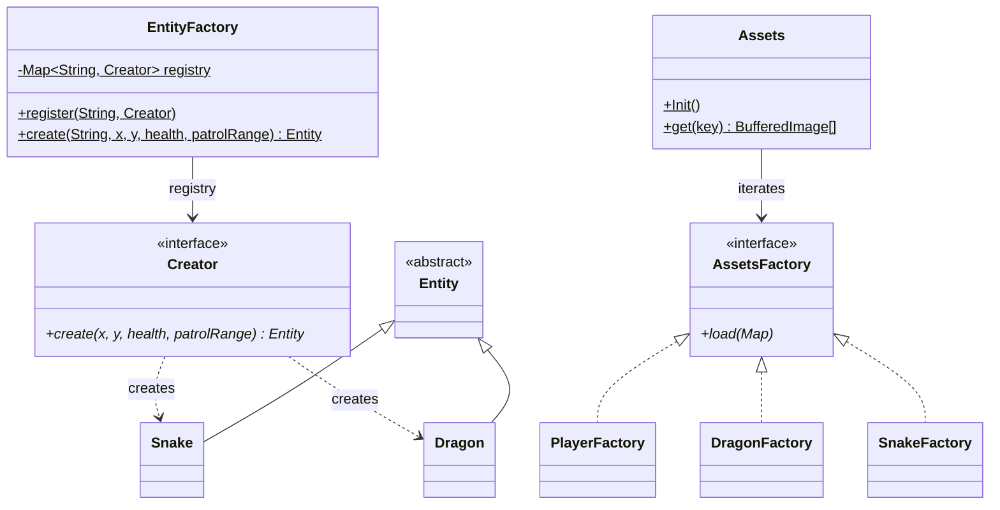
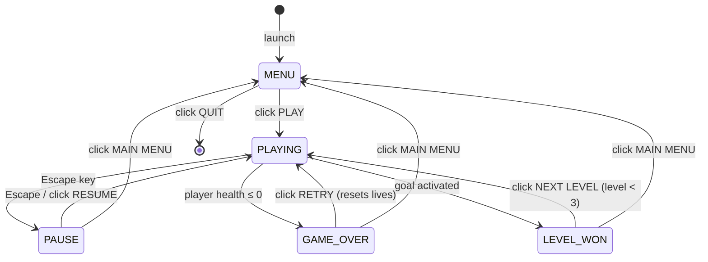

# Platformer Game

A 2D side-scrolling platformer written in pure Java (AWT/Swing), featuring animated characters, tile-based maps, enemy AI, and a gate-based level completion system.

---

## Gameplay

- Navigate through **3 levels**, each with a unique tile theme (grass, castle, stone)
- Defeat all **dragons** on the map — only then do the **portal gates** unlock
- Walk through an unlocked gate to complete the level
- You have **3 hearts**; losing all of them triggers a Game Over
- Completing a level rewards you with **+1 heart** (max 5)

---

## Controls

| Key | Action |
|-----|--------|
| `A` | Move left |
| `D` | Move right |
| `W` | Jump |
| `Space` | Attack |
| `Escape` | Pause / Resume |
| `F3` | Toggle debug hitbox overlay |

---

## Enemies

| Enemy | Behaviour | Damage |
|-------|-----------|--------|
| **Snake** | Patrols back and forth on platforms within a configurable range | 1 HP on contact |
| **Dragon** | Chases player horizontally when within 3 tiles; has gravity; must be killed to unlock the level goal | 2 HP on contact |

---

## Levels

| Level | Theme | Tile Set | Enemies | Level Goal |
|-------|-------|----------|---------|------------|
| 1 | Green grass world | Grass tileset | 4 snakes + 1 green dragon | Portal gate |
| 2 | Red castle | Castle tileset | 3 snakes + 1 blue dragon | Portal gate |
| 3 | Purple stone dungeon | Stone tileset | 3 snakes + 1 purple dragon | Treasure chest |

---

## Architecture

### Class Diagram (UML)



---

## Design Patterns

### Singleton
**Classes:** `Game`, `Player`, `LevelManager`, `MapManager`

Each of these classes has exactly one instance for the lifetime of the session. Access is provided through static factory methods (`createGame`, `createPlayer`, etc.) with **double-checked locking** for thread-safety. The reason is that the global game state (current map, player, level) must be unique and reachable from anywhere in the codebase without being passed explicitly as parameters.

```java
// example — Player
public static Player createPlayer(int mapX, int mapY, int health) {
    if (instance == null) {
        synchronized (Player.class) {
            if (instance == null) instance = new Player(mapX, mapY, health);
        }
    }
    return instance;
}
```

---

### Extensible Factory (Registry-based Factory)
**Class:** `EntityFactory`

`EntityFactory` centralises entity instantiation without knowing anything about concrete types. Instead of a `switch`, it holds a `Map<String, Creator>` registry. Each entity type registers its own constructor lambda from `Game.InitGame()` — `EntityFactory` itself never needs to change when a new enemy is added.

`MapManager` reads the entity type directly as a string from JSON and passes it straight to the factory, with no intermediate enum conversion.

`Assets.Init()` follows the same principle: it iterates a list of `AssetsFactory` implementations (`PlayerFactory`, `DragonFactory`, `SnakeFactory`, etc.), each responsible for loading its own set of images into the global registry.



```java
// EntityFactory.java — never modified when adding new enemies
public static void register(String type, Creator creator) {
    registry.put(type.toLowerCase(), creator);
}
public static Entity create(String type, int x, int y, int health, int patrolRange) {
    Creator creator = registry.get(type.toLowerCase());
    if (creator == null) throw new IllegalArgumentException("Unknown entity: " + type);
    return creator.create(x, y, health, patrolRange);
}

// Game.java — only place that changes when adding a new enemy type
EntityFactory.register("snake",  (x, y, h, p) -> new Snake(x, y, h, p));
EntityFactory.register("dragon", (x, y, h, p) -> new Dragon(x, y, h));
```

---

### Command (Handler Map)
**Class:** `MouseHandler`

Mouse clicks are routed through an `EnumMap<GameStates, Consumer<MouseEvent>>`. Each game state registers its own handler in `Game.InitGame()`, and `MouseHandler` knows nothing about UI logic — it simply invokes the handler mapped to the current state. Adding a new screen only requires one `MouseHandler.register(NEW_STATE, handler)` call.

```java
// registration in Game
MouseHandler.register(GameStates.MENU,  this::handleMenuClick);
MouseHandler.register(GameStates.PAUSE, this::handlePauseClick);

// dispatch in MouseHandler
Consumer<MouseEvent> h = handlers.get(GameStates.current);
if (h != null) h.accept(e);
```

---

### State Machine
**Enum + switch:** `GameStates` + `Game.update()` / `Game.Draw()`

The current game state (`MENU`, `PLAYING`, `PAUSE`, `GAME_OVER`, `LEVEL_WON`) governs both the update logic and the render method. Transitions are explicit and controlled — triggered by input or by in-game conditions — eliminating scattered `if/else` branches throughout the code.

---

### Registry (Service Locator)
**Class:** `Assets`

`Assets` is a static registry (`Map<String, BufferedImage[]>`) populated once at startup and accessed globally via `Assets.get("key")`. The alternative — passing images through constructors — would introduce unnecessary coupling. Any class that needs a sprite retrieves it directly, with no explicit dependency on the factory that loaded it.

---

### Game State Machine



---

### Game Loop

The game loop runs at **60 UPS / 60 FPS** using a fixed-timestep accumulator:

```
while running:
    delta += elapsed / timePerUpdate
    while delta >= 1:
        update()          ← logic (input, physics, AI, collision)
        delta--
    if frameTimerElapsed:
        Draw()            ← render current state
```

Update order per frame (state `PLAYING`):
1. `Player.update(map)` — input, movement, physics, tile effects
2. `Enemy.update(map)` — AI movement (patrol / chase), gravity, knockback
3. `LevelManager.checkCollisions()` — attack hits, body contacts, knockback
4. `LevelGoal.tryActivate(player, dragonsAllDead)` — win condition

Draw order per frame:
1. Background fill (sky blue)
2. Tile map (only visible tiles — culled by camera bounds)
3. `LevelGoal.draw()` — portal / treasure
4. Enemies
5. Player
6. HUD (hearts)

---

### Coordinate System

- **Tile size:** 64 × 64 px
- `mapX`, `mapY` are world-space pixel coordinates
- `mapY` for `Player` and `Dragon` = **bottom of hitbox** (feet position)
- Camera is clamped so the map edge never shows the background
- Screen position formula for all entities:
  ```
  screenX = entity.mapX - player.mapX + player.cameraX
  screenY = entity.mapY - player.mapY + player.cameraY + TILE_HEIGHT
  ```
  The `+TILE_HEIGHT` offset compensates for how tiles are drawn one row lower than their grid index.

---

### Tile Effects

Tile effects are processed each frame inside `Player.update()` via `TileEffectManager`. Every tile that overlaps the player's hitbox triggers the matching effect.

| Effect class | Tile ID | Tile | Behaviour |
|--------------|---------|------|-----------|
| `PlantsEffect` | 3 | Plants (level 1) | `directDamage(0.5)` every 60 frames, lingers 120 frames after last contact |
| `TorchEffect`  | 2 | Torch (level 2) | `takeDamage(1)` + `applySlow(60)` on contact, respects invincibility frames |

---

## Project Structure

```
app/
├── src/
│   ├── Main.java                        # Entry point (1280×640 window)
│   ├── Game.java                        # Game loop, state machine, draw/update dispatch
│   ├── entity/
│   │   ├── Entity.java                  # Abstract base for all entities
│   │   ├── player/Player.java           # Player movement, jump, attack, camera (singleton)
│   │   ├── enamy/Snake.java             # Snake patrol AI
│   │   ├── enamy/Dragon.java            # Dragon boss — chases player, has gravity
│   │   ├── prop/LevelGoal.java          # Interface for level completion triggers
│   │   ├── prop/Portal.java             # Gate — unlocks after all dragons die
│   │   ├── prop/Treasure.java           # Chest — used as goal in level 3
│   │   ├── tileeffect/TileEffect.java   # Interface for tile-based effects on player
│   │   ├── tileeffect/TileEffectManager.java
│   │   ├── tileeffect/PlantsEffect.java
│   │   ├── tileeffect/TorchEffect.java
│   │   └── utils/MoveInfo.java          # Tile collision helpers
│   ├── levelmanager/
│   │   ├── LevelManager.java            # Level loading, enemy list, lives (singleton)
│   │   ├── CollisionManager.java        # Attack and body collision resolution
│   │   ├── LevelRenderer.java           # Camera, tile map, entity and goal drawing
│   │   └── HUD.java                     # Hearts display
│   ├── map/
│   │   ├── Map.java                     # Map data model (grid + enemies + gate coords)
│   │   └── MapManager.java              # JSON map loader (Gson)
│   ├── graphics/
│   │   ├── assets/Assets.java           # Central image registry (static map)
│   │   ├── assets/*Factory.java         # Per-category asset loaders
│   │   ├── tiles/Tile.java              # Tile constants (64×64 px)
│   │   └── utils/SpriteSheet.java       # Sprite sheet cropper
│   ├── screen/
│   │   ├── Screen.java                  # Interface — draw() + default no-op handleClick()
│   │   ├── PlayingScreen.java           # Background fill + levelManager.draw()
│   │   ├── MenuScreen.java              # Menu UI + PLAY/QUIT click handling
│   │   ├── PauseScreen.java             # Pause overlay + RESUME/MENU click handling
│   │   ├── GameOverScreen.java          # Game-over overlay + RETRY/MENU click handling
│   │   ├── LevelWonScreen.java          # Level-won overlay + NEXT/MENU click handling
│   │   └── ScreenHelper.java            # Shared button constants + drawButton() utility
│   ├── handle/
│   │   ├── KeyHandler.java              # Keyboard input (static booleans)
│   │   └── MouseHandler.java            # Mouse click routing per game state
│   ├── gamewindow/GameWindow.java        # JFrame + Canvas wrapper
│   └── utils/
│       ├── GameStates.java              # MENU, PLAYING, PAUSE, GAME_OVER, LEVEL_WON
│       ├── TileID.java                  # Tile ID → asset key mapping
│       └── LevelMaps.java               # Map name enum
└── res/textures/
    ├── maps/maps.json                   # Map grids + enemy spawn data (20×60 tiles)
    ├── player/                          # Player sprite sheets (run, jump, attack, idle, hurt)
    ├── enemies/                         # Snake & dragon sprites
    └── utils/                           # Props, tiles, UI, lives, gates
```

---

## How to Run

Requires **Java 17+** and the Gson library (`gson-2.13.2.jar` included in the repo root).

### IntelliJ IDEA

1. Open the `app/` folder as an IntelliJ project
2. Add `gson-2.13.2.jar` to the module dependencies (*File → Project Structure → Libraries*)
3. Run `Main`

### Command line

```bash
javac -cp ".;../gson-2.13.2.jar" -d out src/**/*.java src/*.java
java  -cp "out;../gson-2.13.2.jar" Main
```

---

## Used Assets

### 🧙 Characters

| Asset | Author | License | Link |
|-------|--------|---------|------|
| **Chibi Knight** | Segel T | — | [Facebook](https://www.facebook.com/Segel.T) |

---

### 🐍 Enemies

| Asset | Author | License | Link |
|-------|--------|---------|------|
| **Stendhal Dragons** | Kimmo Rundelin (kiheru), uploaded by StendhalGame | CC BY-SA 3.0 | [OpenGameArt](https://opengameart.org/content/stendhal-dragons) |

---

### 🏰 Tilesets & Environments

| Asset | Author | License | Link |
|-------|--------|---------|------|
| **Platformer Castle Tileset** | thomaswp (PlatForge) — Artists: Summer Thaxton & Stafford McIntyre | CC BY-SA 3.0 | [OpenGameArt](https://opengameart.org/content/platformer-castle-tileset) |
| **Platformer Night Tileset** | thomaswp (PlatForge) — Artists: Summer Thaxton & Hannah Cohan | CC BY-SA 3.0 | [OpenGameArt](https://opengameart.org/content/platformer-night-tileset) |
| **Platformer Grass Tileset** | thomaswp (PlatForge) — Artists: Summer Thaxton & Hannah Cohan | CC BY-SA 3.0 | [OpenGameArt](https://opengameart.org/content/platformer-grass-tileset) |
| **Golden Treasures** | Ironthunder *(special thanks to Marcus Brumfield)* | CC BY 4.0 | [OpenGameArt](https://opengameart.org/content/golden-treasures) |

---

### 🔥 Effects

| Asset | Author | License | Link |
|-------|--------|---------|------|
| **Fireball Spell** | Clint Bellanger | CC BY 3.0 | [OpenGameArt](https://opengameart.org/content/fireball-spell) |

---

⚠️ **Note:** Some assets may have been resized or scaled to fit the game's requirements. Original files remain the property of their respective authors.

## ❤️ Special Thanks

A big thank you to **Segel T** for the charming Chibi Knight character, and to **Clint Bellanger**, **Disthron**, **Jason-Em (GrafxKid)**, **thomaswp**, and **Kimmo Rundelin** for making free, high-quality game assets available to everyone through **OpenGameArt.org**. You make indie game development possible. 🙏

---

## 🔗 Resources

- [OpenGameArt.org](https://opengameart.org) — Free game assets for everyone
- [PlatForge Collection on OGA](https://opengameart.org/content/art-from-platforge) — All PlatForge art assets

---

## TODO

### Game features
- [ ] **Fix level 2 map** — tile layout and enemy placement need rework
- [ ] **Fix level 3 map** — tile layout and enemy placement need rework
- [ ] Add sound effects and background music
- [ ] Add dragon attack animation and damage towards player

### SOLID refactoring
- [ ] **LSP** — remove the duplicate `draw()` signature from `Entity`; subclasses currently leave one of the two overloads empty, which breaks substitutability
- [ ] **ISP** — split `Entity` into focused interfaces (e.g. `Drawable`, `Updatable`) so subclasses are not forced to implement methods they do not use
- [ ] **DIP** — `LevelManager` depends on concrete `Player`, `Dragon`, `Snake`; introduce abstractions (e.g. reference enemies as `List<Entity>` everywhere and avoid `instanceof Dragon` casts)
